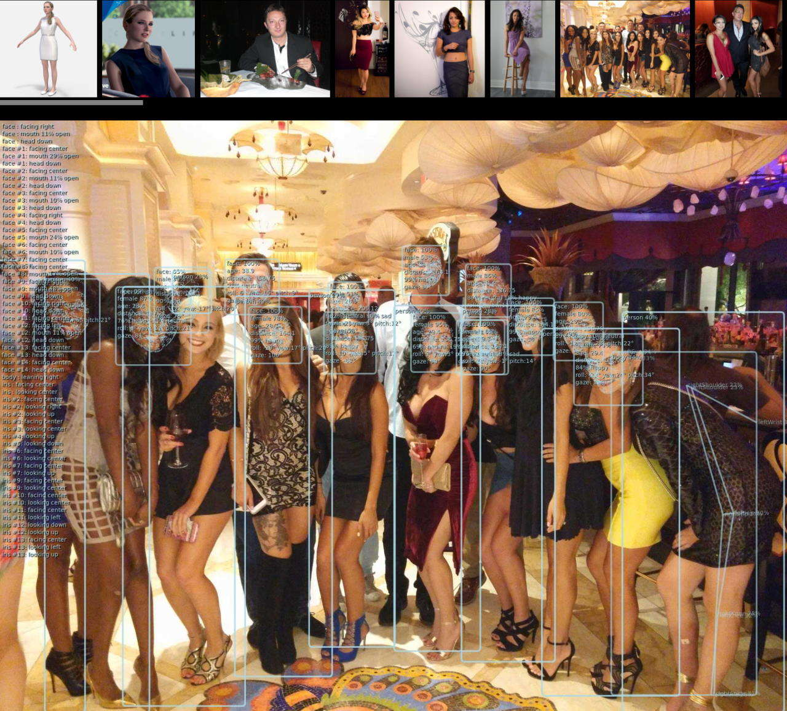
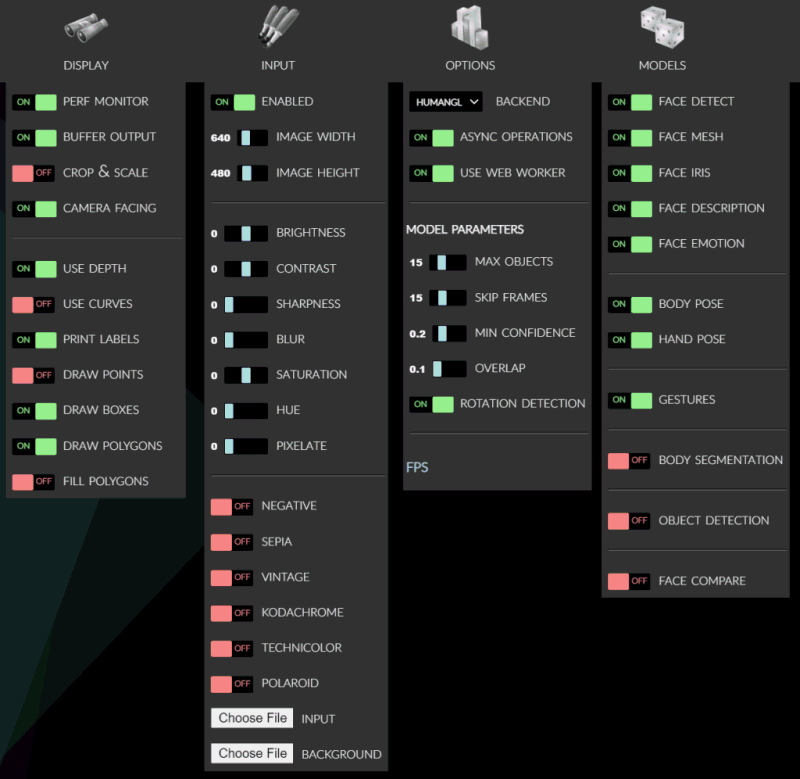

[](https://github.com/sponsors/vladmandic)


# Human Library

**AI-powered 3D Face Detection & Rotation Tracking, Face Description & Recognition,**  
**Body Pose Tracking, 3D Hand & Finger Tracking, Iris Analysis,**  
**Age & Gender & Emotion Prediction, Gaze Tracking, Gesture Recognition, Body Segmentation**  

JavaScript module using TensorFlow/JS Machine Learning library  
## Highlights

- Compatible with most server-side and client-side environments and frameworks  
- Combines multiple machine learning models which can be switched on-demand depending on the use-case  
- Related models are executed in an attention pipeline to provide details when needed  
- Optimized input pre-processing that can enhance image quality of any type of inputs  
- Detection of frame changes to trigger only required models for improved performance  
- Intelligent temporal interpolation to provide smooth results regardless of processing performance  
- Simple unified API  

<br>

## Compatibility

- **Browser**:  
  Compatible with both desktop and mobile platforms  
  Compatible with *CPU*, *WebGL*, *WASM* backends  
  Compatible with *WebWorker* execution  
  Compatible with *WebView*  
- **NodeJS**:  
  Compatibile with *WASM* backend for executions on architectures where *tensorflow* binaries are not available  
  Compatible with *tfjs-node* using software execution via *tensorflow* shared libraries  
  Compatible with *tfjs-node* using GPU-accelerated execution via *tensorflow* shared libraries and nVidia CUDA  

<br>

## Releases
- [Release Notes](https://github.com/vladmandic/human/releases)
- [NPM Link](https://www.npmjs.com/package/@vladmandic/human)
## Demos

*Check out [**Simple Live Demo**](https://vladmandic.github.io/human/demo/typescript/index.html) fully annotated app as a good start starting point ([html](https://github.com/vladmandic/human/blob/main/demo/typescript/index.html))([code](https://github.com/vladmandic/human/blob/main/demo/typescript/index.ts))*  

*Check out [**Main Live Demo**](https://vladmandic.github.io/human/demo/index.html) app for advanced processing of of webcam, video stream or images static images with all possible tunable options*  

- To start video detection, simply press *Play*  
- To process images, simply drag & drop in your Browser window  
- Note: For optimal performance, select only models you'd like to use
- Note: If you have modern GPU, *WebGL* (default) backend is preferred, otherwise select *WASM* backend

<br>


- [**List of all Demo applications**](https://github.com/vladmandic/human/wiki/Demos)
- [**Live Examples galery**](https://vladmandic.github.io/human/samples/index.html)

### Browser Demos

*All browser demos are self-contained without any external dependencies*

- **Full** [[*Live*]](https://vladmandic.github.io/human/demo/index.html) [[*Details*]](https://github.com/vladmandic/human/tree/main/demo): Main browser demo app that showcases all Human capabilities
- **Simple** [[*Live*]](https://vladmandic.github.io/human/demo/typescript/index.html) [[*Details*]](https://github.com/vladmandic/human/tree/main/demo/typescript): Simple demo in WebCam processing demo in TypeScript
- **Embedded** [[*Live*]](https://vladmandic.github.io/human/demo/video/index.html) [[*Details*]](https://github.com/vladmandic/human/tree/main/video/index.html): Even simpler demo with tiny code embedded in HTML file
- **Face Match** [[*Live*]](https://vladmandic.github.io/human/demo/facematch/index.html) [[*Details*]](https://github.com/vladmandic/human/tree/main/demo/facematch): Extract faces from images, calculates face descriptors and simmilarities and matches them to known database
- **Face ID** [[*Live*]](https://vladmandic.github.io/human/demo/faceid/index.html) [[*Details*]](https://github.com/vladmandic/human/tree/main/demo/faceid): Runs multiple checks to validate webcam input before performing face match to faces in IndexDB
- **Multi-thread** [[*Live*]](https://vladmandic.github.io/human/demo/multithread/index.html) [[*Details*]](https://github.com/vladmandic/human/tree/main/demo/multithread): Runs each Human module in a separate web worker for highest possible performance  
- **NextJS** [[*Live*]](https://vladmandic.github.io/human-next/out/index.html) [[*Details*]](https://github.com/vladmandic/human-next): Use Human with TypeScript, NextJS and ReactJS
- **ElectronJS** [[*Details*]](https://github.com/vladmandic/human-electron): Use Human with TypeScript and ElectonJS to create standalone cross-platform apps
- **3D Analysis with BabylonJS** [[*Live*]](https://vladmandic.github.io/human-motion/src/index.html) [[*Details*]](https://github.com/vladmandic/human-motion): 3D tracking and visualization of heead, face, eye, body and hand
- **VRM Virtual Model Tracking with Three.JS** [[*Live*]](https://vladmandic.github.io/human-three-vrm/src/human-vrm.html) [[*Details*]](https://github.com/vladmandic/human-three-vrm): VR model with head, face, eye, body and hand tracking  
- **VRM Virtual Model Tracking with BabylonJS** [[*Live*]](https://vladmandic.github.io/human-bjs-vrm/src/index.html) [[*Details*]](https://github.com/vladmandic/human-bjs-vrm): VR model with head, face, eye, body and hand tracking  

### NodeJS Demos

*NodeJS demos may require extra dependencies which are used to decode inputs*  
*See header of each demo to see its dependencies as they are not automatically installed with `Human`*

- **Main** [[*Details*]](https://github.com/vladmandic/human/tree/main/demo/nodejs): Process images from files, folders or URLs using native methods  
- **Canvas** [[*Details*]](https://github.com/vladmandic/human/tree/main/demo/nodejs): Process image from file or URL and draw results to a new image file using `node-canvas`  
- **Video** [[*Details*]](https://github.com/vladmandic/human/tree/main/demo/nodejs): Processing of video input using `ffmpeg`  
- **WebCam** [[*Details*]](https://github.com/vladmandic/human/tree/main/demo/nodejs): Processing of webcam screenshots using `fswebcam`  
- **Events** [[*Details*]](https://github.com/vladmandic/human/tree/main/demo/nodejs): Showcases usage of `Human` eventing to get notifications on processing
- **Similarity** [[*Details*]](https://github.com/vladmandic/human/tree/main/demo/nodejs): Compares two input images for similarity of detected faces
- **Face Match** [[*Details*]](https://github.com/vladmandic/human/tree/main/demo/facematch): Parallel processing of face **match** in multiple child worker threads
- **Multiple Workers** [[*Details*]](https://github.com/vladmandic/human/tree/main/demo/nodejs): Runs multiple parallel `human` by dispaching them to pool of pre-created worker processes  

## Project pages

- [**Code Repository**](https://github.com/vladmandic/human)
- [**NPM Package**](https://www.npmjs.com/package/@vladmandic/human)
- [**Issues Tracker**](https://github.com/vladmandic/human/issues)
- [**TypeDoc API Specification**](https://vladmandic.github.io/human/typedoc/classes/Human.html)
- [**Change Log**](https://github.com/vladmandic/human/blob/main/CHANGELOG.md)
- [**Current To-do List**](https://github.com/vladmandic/human/blob/main/TODO.md)

## Wiki pages

- [**Home**](https://github.com/vladmandic/human/wiki)
- [**Installation**](https://github.com/vladmandic/human/wiki/Install)
- [**Usage & Functions**](https://github.com/vladmandic/human/wiki/Usage)
- [**Configuration Details**](https://github.com/vladmandic/human/wiki/Config)
- [**Result Details**](https://github.com/vladmandic/human/wiki/Result)
- [**Caching & Smoothing**](https://github.com/vladmandic/human/wiki/Caching)
- [**Input Processing**](https://github.com/vladmandic/human/wiki/Image)
- [**Face Recognition & Face Description**](https://github.com/vladmandic/human/wiki/Embedding)
- [**Gesture Recognition**](https://github.com/vladmandic/human/wiki/Gesture)
- [**Common Issues**](https://github.com/vladmandic/human/wiki/Issues)
- [**Background and Benchmarks**](https://github.com/vladmandic/human/wiki/Background)

## Additional notes

- [**Comparing Backends**](https://github.com/vladmandic/human/wiki/Backends)
- [**Development Server**](https://github.com/vladmandic/human/wiki/Development-Server)
- [**Build Process**](https://github.com/vladmandic/human/wiki/Build-Process)
- [**Adding Custom Modules**](https://github.com/vladmandic/human/wiki/Module)
- [**Performance Notes**](https://github.com/vladmandic/human/wiki/Performance)
- [**Performance Profiling**](https://github.com/vladmandic/human/wiki/Profiling)
- [**Platform Support**](https://github.com/vladmandic/human/wiki/Platforms)
- [**Diagnostic and Performance trace information**](https://github.com/vladmandic/human/wiki/Diag)
- [**Dockerize Human applications**](https://github.com/vladmandic/human/wiki/Docker)
- [**List of Models & Credits**](https://github.com/vladmandic/human/wiki/Models)
- [**Models Download Repository**](https://github.com/vladmandic/human-models)
- [**Security & Privacy Policy**](https://github.com/vladmandic/human/blob/main/SECURITY.md)
- [**License & Usage Restrictions**](https://github.com/vladmandic/human/blob/main/LICENSE)

<br>

*See [**issues**](https://github.com/vladmandic/human/issues?q=) and [**discussions**](https://github.com/vladmandic/human/discussions) for list of known limitations and planned enhancements*  

*Suggestions are welcome!*  

<hr><br>

## App Examples

Visit [Examples gallery](https://vladmandic.github.io/human/samples/index.html) for more examples  
<https://vladmandic.github.io/human/samples/index.html>



<br>

## Options

All options as presented in the demo application...  
> [demo/index.html](demo/index.html)  



<br>

**Results Browser:**  
[ *Demo -> Display -> Show Results* ]<br>


<br>

## Advanced Examples

1. **Face Similarity Matching:**  
Extracts all faces from provided input images,  
sorts them by similarity to selected face  
and optionally matches detected face with database of known people to guess their names
> [demo/facematch](demo/facematch/index.html)  


<br>

2. **3D Rendering:**  
> [human-motion](https://github.com/vladmandic/human-motion)


<br>

3. **VR Model Tracking:**  
> [human-three-vrm](https://github.com/vladmandic/human-three-vrm)  
> [human-bjs-vrm](https://github.com/vladmandic/human-bjs-vrm)  


4. **Human as OS native application:**
> [human-electron](https://github.com/vladmandic/human-electron)

<br>

**468-Point Face Mesh Defails:**  
(view in full resolution to see keypoints)  


<br><hr><br>

## Quick Start

Simply load `Human` (*IIFE version*) directly from a cloud CDN in your HTML file:  
(pick one: `jsdelirv`, `unpkg` or `cdnjs`)

```html
<script src="https://cdn.jsdelivr.net/npm/@vladmandic/human/dist/human.js"></script>
<script src="https://unpkg.dev/@vladmandic/human/dist/human.js"></script>
<script src="https://cdnjs.cloudflare.com/ajax/libs/human/2.1.5/human.js"></script>
```

For details, including how to use `Browser ESM` version or `NodeJS` version of `Human`, see [**Installation**](https://github.com/vladmandic/human/wiki/Install)

<br>

## Inputs

`Human` library can process all known input types:  

- `Image`, `ImageData`, `ImageBitmap`, `Canvas`, `OffscreenCanvas`, `Tensor`,  
- `HTMLImageElement`, `HTMLCanvasElement`, `HTMLVideoElement`, `HTMLMediaElement`

Additionally, `HTMLVideoElement`, `HTMLMediaElement` can be a standard `<video>` tag that links to:

- WebCam on user's system
- Any supported video type  
  e.g. `.mp4`, `.avi`, etc.
- Additional video types supported via *HTML5 Media Source Extensions*  
  e.g.: **HLS** (*HTTP Live Streaming*) using `hls.js` or **DASH** (*Dynamic Adaptive Streaming over HTTP*) using `dash.js`
- **WebRTC** media track using built-in support  

<br>

## Code Examples

Simple app that uses Human to process video input and  
draw output on screen using internal draw helper functions

```js
// create instance of human with simple configuration using default values
const config = { backend: 'webgl' };
const human = new Human(config);
// select input HTMLVideoElement and output HTMLCanvasElement from page
const inputVideo = document.getElementById('video-id');
const outputCanvas = document.getElementById('canvas-id');

function detectVideo() {
  // perform processing using default configuration
  human.detect(inputVideo).then((result) => {
    // result object will contain detected details
    // as well as the processed canvas itself
    // so lets first draw processed frame on canvas
    human.draw.canvas(result.canvas, outputCanvas);
    // then draw results on the same canvas
    human.draw.face(outputCanvas, result.face);
    human.draw.body(outputCanvas, result.body);
    human.draw.hand(outputCanvas, result.hand);
    human.draw.gesture(outputCanvas, result.gesture);
    // and loop immediate to the next frame
    requestAnimationFrame(detectVideo);
  });
}

detectVideo();
```

or using `async/await`:

```js
// create instance of human with simple configuration using default values
const config = { backend: 'webgl' };
const human = new Human(config); // create instance of Human
const inputVideo = document.getElementById('video-id');
const outputCanvas = document.getElementById('canvas-id');

async function detectVideo() {
  const result = await human.detect(inputVideo); // run detection
  human.draw.all(outputCanvas, result); // draw all results
  requestAnimationFrame(detectVideo); // run loop
}

detectVideo(); // start loop
```

or using `Events`:

```js
// create instance of human with simple configuration using default values
const config = { backend: 'webgl' };
const human = new Human(config); // create instance of Human
const inputVideo = document.getElementById('video-id');
const outputCanvas = document.getElementById('canvas-id');

human.events.addEventListener('detect', () => { // event gets triggered when detect is complete
  human.draw.all(outputCanvas, human.result); // draw all results
});

function detectVideo() {
  human.detect(inputVideo) // run detection
  .then(() => requestAnimationFrame(detectVideo)); // upon detect complete start processing of the next frame
}

detectVideo(); // start loop
```

or using interpolated results for smooth video processing by separating detection and drawing loops:

```js
const human = new Human(); // create instance of Human
const inputVideo = document.getElementById('video-id');
const outputCanvas = document.getElementById('canvas-id');
let result;

async function detectVideo() {
  result = await human.detect(inputVideo); // run detection
  requestAnimationFrame(detectVideo); // run detect loop
}

async function drawVideo() {
  if (result) { // check if result is available
    const interpolated = human.next(result); // get smoothened result using last-known results
    human.draw.all(outputCanvas, interpolated); // draw the frame
  }
  requestAnimationFrame(drawVideo); // run draw loop
}

detectVideo(); // start detection loop
drawVideo(); // start draw loop
```

or same, but using built-in full video processing instead of running manual frame-by-frame loop:

```js
const human = new Human(); // create instance of Human
const inputVideo = document.getElementById('video-id');
const outputCanvas = document.getElementById('canvas-id');

async function drawResults() {
  const interpolated = human.next(); // get smoothened result using last-known results
  human.draw.all(outputCanvas, interpolated); // draw the frame
  requestAnimationFrame(drawVideo); // run draw loop
}

human.video(inputVideo); // start detection loop which continously updates results
drawResults(); // start draw loop
```

And for even better results, you can run detection in a separate web worker thread

<br><hr><br>

## Default models

Default models in Human library are:

- **Face Detection**: *MediaPipe BlazeFace Back variation*
- **Face Mesh**: *MediaPipe FaceMesh*
- **Face Iris Analysis**: *MediaPipe Iris*
- **Face Description**: *HSE FaceRes*
- **Emotion Detection**: *Oarriaga Emotion*
- **Body Analysis**: *MoveNet Lightning variation*
- **Hand Analysis**: *HandTrack & MediaPipe HandLandmarks*
- **Body Segmentation**: *Google Selfie*
- **Object Detection**: *CenterNet with MobileNet v3*

Note that alternative models are provided and can be enabled via configuration  
For example, body pose detection by default uses *MoveNet Lightning*, but can be switched to *MultiNet Thunder* for higher precision or *Multinet MultiPose* for multi-person detection or even *PoseNet*, *BlazePose* or *EfficientPose* depending on the use case  

For more info, see [**Configuration Details**](https://github.com/vladmandic/human/wiki/Configuration) and [**List of Models**](https://github.com/vladmandic/human/wiki/Models)

<br><hr><br>

## Diagnostics

- [How to get diagnostic information or performance trace information](https://github.com/vladmandic/human/wiki/Diag)

<br><hr><br>

`Human` library is written in `TypeScript` [4.8](https://www.typescriptlang.org/docs/handbook/intro.html)  
Conforming to latest `JavaScript` [ECMAScript version 2022](https://262.ecma-international.org/) standard  
Build target is `JavaScript` [EMCAScript version 2018](https://262.ecma-international.org/11.0/)  

<br>

For details see [**Wiki Pages**](https://github.com/vladmandic/human/wiki)  
and [**API Specification**](https://vladmandic.github.io/human/typedoc/classes/Human.html)

<br>

[](https://github.com/sponsors/vladmandic)


<br>


