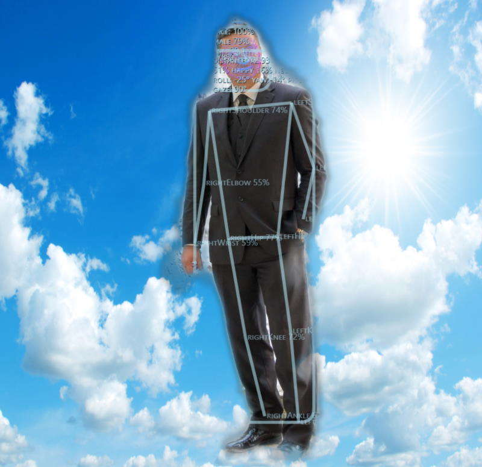
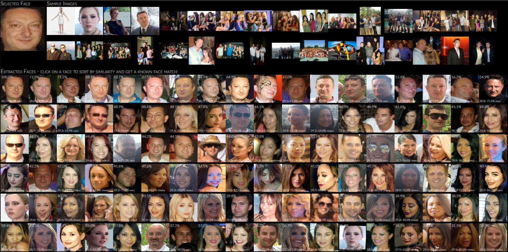
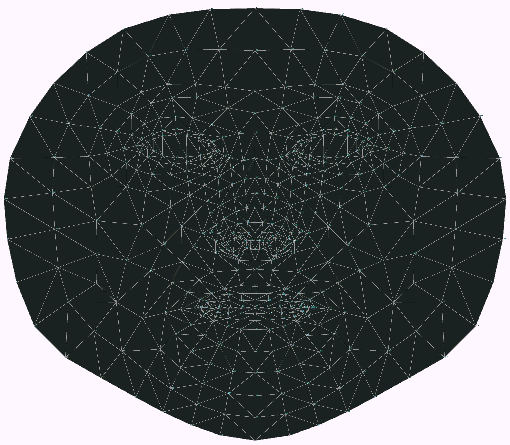

# Human Library

**AI-powered 3D Face Detection & Rotation Tracking, Face Description & Recognition,**  
**Body Pose Tracking, 3D Hand & Finger Tracking, Iris Analysis,**  
**Age & Gender & Emotion Prediction, Gaze Tracking, Gesture Recognition, Body Segmentation**  

<br>

JavaScript module using TensorFlow/JS Machine Learning library  

- **Browser**:  
  Compatible with both desktop and mobile platforms  
  Compatible with *CPU*, *WebGL*, *WASM* backends  
  Compatible with *WebWorker* execution
- **NodeJS**:  
  Compatible with both software *tfjs-node* and  
  GPU accelerated backends *tfjs-node-gpu* using CUDA libraries  

<br>

Check out [**Live Demo**](https://vladmandic.github.io/human/demo/index.html) app for processing of live WebCam video or static images  

- To start video detection, simply press *Play*  
- To process images, simply drag & drop in your Browser window  
- Note: For optimal performance, select only models you'd like to use
- Note: If you have modern GPU, WebGL (default) backend is preferred, otherwise select WASM backend

<br>

*Note: `Human` Release 2.0 contains large list of changes, see [Change log](https://github.com/vladmandic/human/blob/main/CHANGELOG.md) for details*

<br>

## Demos

- [**Main Application**](https://vladmandic.github.io/human/demo/index.html)
- [**Face Extraction, Description, Identification and Matching**](https://vladmandic.github.io/human/demo/facematch/index.html)
- [**Face Extraction and 3D Rendering**](https://vladmandic.github.io/human/demo/face3d/index.html)
- [**Details on Demo Applications**](https://github.com/vladmandic/human/wiki/Demos)

## Project pages

- [**Code Repository**](https://github.com/vladmandic/human)
- [**NPM Package**](https://www.npmjs.com/package/@vladmandic/human)
- [**Issues Tracker**](https://github.com/vladmandic/human/issues)
- [**TypeDoc API Specification: Human**](https://vladmandic.github.io/human/typedoc/classes/human.html)
- [**TypeDoc API Specification: Root**](https://vladmandic.github.io/human/typedoc/)
- [**Change Log**](https://github.com/vladmandic/human/blob/main/CHANGELOG.md)
- [**Current To-do List**](https://github.com/vladmandic/human/blob/main/TODO.md)

## Wiki pages

- [**Home**](https://github.com/vladmandic/human/wiki)
- [**Installation**](https://github.com/vladmandic/human/wiki/Install)
- [**Usage & Functions**](https://github.com/vladmandic/human/wiki/Usage)
- [**Configuration Details**](https://github.com/vladmandic/human/wiki/Configuration)
- [**Output Details**](https://github.com/vladmandic/human/wiki/Outputs)
- [**Face Recognition & Face Description**](https://github.com/vladmandic/human/wiki/Embedding)
- [**Gesture Recognition**](https://github.com/vladmandic/human/wiki/Gesture)
- [**Common Issues**](https://github.com/vladmandic/human/wiki/Issues)
- [**Background and Benchmarks**](https://github.com/vladmandic/human/wiki/Background)

## Additional notes

- [**Notes on Backends**](https://github.com/vladmandic/human/wiki/Backends)
- [**Development Server**](https://github.com/vladmandic/human/wiki/Development-Server)
- [**Build Process**](https://github.com/vladmandic/human/wiki/Build-Process)
- [**Performance Notes**](https://github.com/vladmandic/human/wiki/Performance)
- [**Performance Profiling**](https://github.com/vladmandic/human/wiki/Profiling)
- [**Platform Support**](https://github.com/vladmandic/human/wiki/Platforms)
- [**List of Models & Credits**](https://github.com/vladmandic/human/wiki/Models)
- [**Security & Privacy Policy**](https://github.com/vladmandic/human/blob/main/SECURITY.md)
- [**License & Usage Restrictions**](https://github.com/vladmandic/human/blob/main/LICENSE)

<br>

*See [**issues**](https://github.com/vladmandic/human/issues?q=) and [**discussions**](https://github.com/vladmandic/human/discussions) for list of known limitations and planned enhancements*  

*Suggestions are welcome!*  

<hr><br>

## Options

All options as presented in the demo application...  
> [demo/index.html](demo/index.html)  


<br>

## Examples

<br>

**Face Close-up:**  


<br>

**Face under a high angle:**  


<br>

**Full Person Details:**  


<br>

**Pose Detection:**  


<br>

**Body Segmentation and Background Replacement:**  


<br>

**Large Group:**  


<br>

**Face Similarity Matching:**  
Extracts all faces from provided input images,  
sorts them by similarity to selected face  
and optionally matches detected face with database of known people to guess their names
> [demo/facematch](demo/facematch/index.html)  



<br>

**Face3D OpenGL Rendering:**  
> [demo/face3d](demo/face3d/index.html)


<br>

**468-Point Face Mesh Defails:**  
(view in full resolution to see keypoints)  



<br><hr><br>

## Quick Start

Simply load `Human` (*IIFE version*) directly from a cloud CDN in your HTML file:  
(pick one: `jsdelirv`, `unpkg` or `cdnjs`)

```html
<script src="https://cdn.jsdelivr.net/npm/@vladmandic/human/dist/human.js"></script>
<script src="https://unpkg.dev/@vladmandic/human/dist/human.js"></script>
<script src="https://cdnjs.cloudflare.com/ajax/libs/human/1.4.1/human.js"></script>
```

For details, including how to use `Browser ESM` version or `NodeJS` version of `Human`, see [**Installation**](https://github.com/vladmandic/human/wiki/Install)

<br>

## Inputs

`Human` library can process all known input types:  

- `Image`, `ImageData`, `ImageBitmap`, `Canvas`, `OffscreenCanvas`, `Tensor`,  
- `HTMLImageElement`, `HTMLCanvasElement`, `HTMLVideoElement`, `HTMLMediaElement`

Additionally, `HTMLVideoElement`, `HTMLMediaElement` can be a standard `<video>` tag that links to:

- WebCam on user's system
- Any supported video type  
  For example: `.mp4`, `.avi`, etc.
- Additional video types supported via *HTML5 Media Source Extensions*  
  Live streaming examples:
  - **HLS** (*HTTP Live Streaming*) using `hls.js`
  - **DASH** (Dynamic Adaptive Streaming over HTTP) using `dash.js`
- **WebRTC** media track using built-in support  

<br>

## Example

Example simple app that uses Human to process video input and  
draw output on screen using internal draw helper functions

```js
// create instance of human with simple configuration using default values
const config = { backend: 'webgl' };
const human = new Human(config);

function detectVideo() {
  // select input HTMLVideoElement and output HTMLCanvasElement from page
  const inputVideo = document.getElementById('video-id');
  const outputCanvas = document.getElementById('canvas-id');
  // perform processing using default configuration
  human.detect(inputVideo).then((result) => {
    // result object will contain detected details
    // as well as the processed canvas itself
    // so lets first draw processed frame on canvas
    human.draw.canvas(result.canvas, outputCanvas);
    // then draw results on the same canvas
    human.draw.face(outputCanvas, result.face);
    human.draw.body(outputCanvas, result.body);
    human.draw.hand(outputCanvas, result.hand);
    human.draw.gesture(outputCanvas, result.gesture);
    // and loop immediate to the next frame
    requestAnimationFrame(detectVideo);
  });
}

detectVideo();
```

or using `async/await`:

```js
// create instance of human with simple configuration using default values
const config = { backend: 'webgl' };
const human = new Human(config); // create instance of Human

async function detectVideo() {
  const inputVideo = document.getElementById('video-id');
  const outputCanvas = document.getElementById('canvas-id');
  const result = await human.detect(inputVideo); // run detection
  human.draw.all(outputCanvas, result); // draw all results
  requestAnimationFrame(detectVideo); // run loop
}

detectVideo(); // start loop
```

or using interpolated results for smooth video processing by separating detection and drawing loops:

```js
const human = new Human(); // create instance of Human
const inputVideo = document.getElementById('video-id');
const outputCanvas = document.getElementById('canvas-id');
let result;

async function detectVideo() {
  result = await human.detect(inputVideo); // run detection
  requestAnimationFrame(detectVideo); // run detect loop
}

async function drawVideo() {
  if (result) { // check if result is available
    const interpolated = human.next(result); // calculate next interpolated frame
    human.draw.all(outputCanvas, interpolated); // draw the frame
  }
  requestAnimationFrame(drawVideo); // run draw loop
}

detectVideo(); // start detection loop
drawVideo(); // start draw loop
```

And for even better results, you can run detection in a separate web worker thread

<br><hr><br>

## Default models

Default models in Human library are:

- **Face Detection**: MediaPipe BlazeFace - Back variation
- **Face Mesh**: MediaPipe FaceMesh
- **Face Iris Analysis**: MediaPipe Iris
- **Face Description**: HSE FaceRes
- **Emotion Detection**: Oarriaga Emotion
- **Body Analysis**: MoveNet - Lightning variation

Note that alternative models are provided and can be enabled via configuration  
For example, `PoseNet` model can be switched for `BlazePose`, `EfficientPose` or `MoveNet` model depending on the use case  

For more info, see [**Configuration Details**](https://github.com/vladmandic/human/wiki/Configuration) and [**List of Models**](https://github.com/vladmandic/human/wiki/Models)

<br><hr><br>

`Human` library is written in `TypeScript` [4.3](https://www.typescriptlang.org/docs/handbook/intro.html)  
Conforming to `JavaScript` [ECMAScript version 2020](https://www.ecma-international.org/ecma-262/11.0/index.html) standard  
Build target is `JavaScript` [EMCAScript version 2018](https://262.ecma-international.org/9.0/)  

<br>

For details see [**Wiki Pages**](https://github.com/vladmandic/human/wiki)  
and [**API Specification**](https://vladmandic.github.io/human/typedoc/classes/human.html)

<br>


<br>


